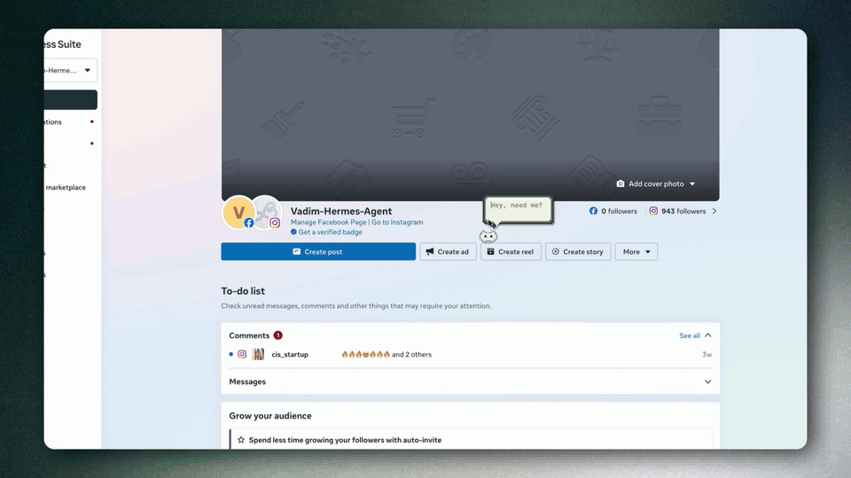
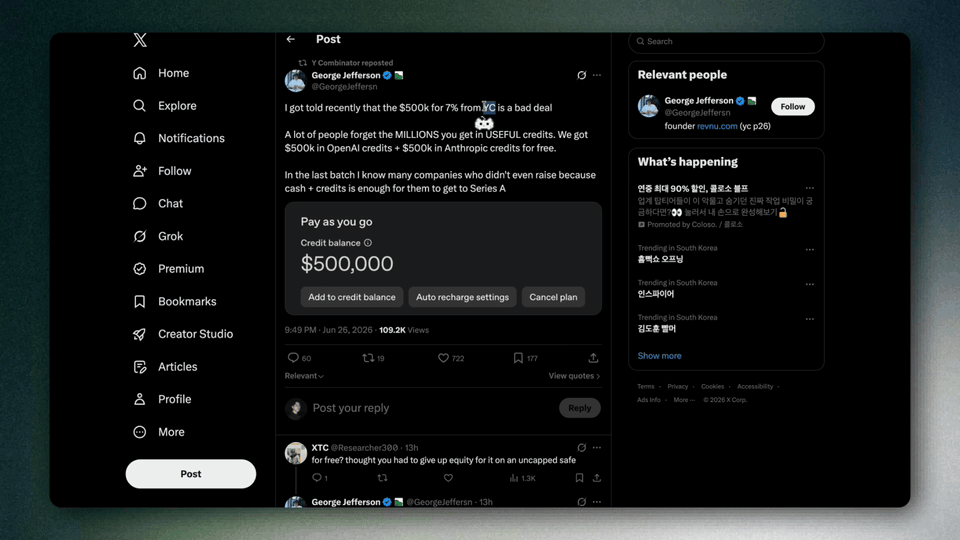
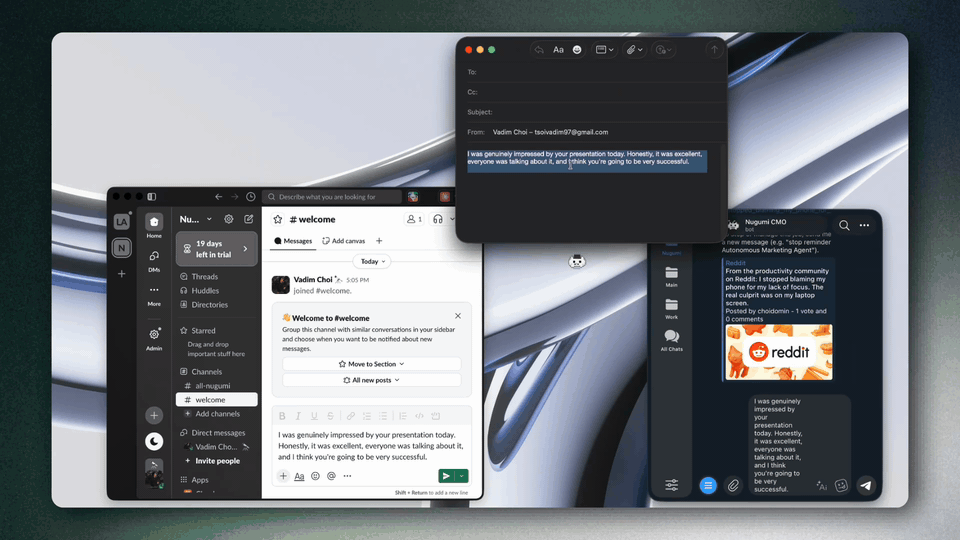
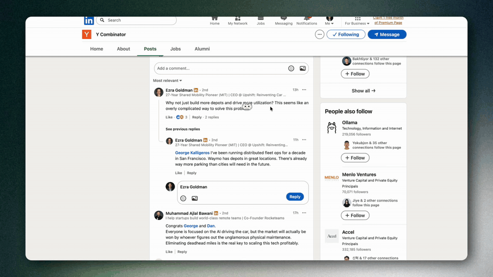

<div align="center">


# Gizmate

**Understand, write, reply, and ask your screen without leaving the Mac app you are using.**

Gizmate is a native macOS assistant for people who work across languages every day. It sits next to your cursor, understands the action you are trying to take, and helps with selected text, screen captures, replies, writing tone, and live captions.

<br>

<a href="https://github.com/ChoiVadim/nugumi/releases/latest">
  
</a>

<br><br>


</div>

<br>


## What Gizmate Does

Gizmate handles the small language gaps that interrupt real work: reading a foreign-language UI, rewriting a rough draft, answering a customer message, translating a selected paragraph, or asking what a warning on your screen means.

It works in normal Mac apps, not only inside a browser tab: Slack, Gmail, Notion, GitHub, Telegram, Preview, Messages, Discord, code editors, websites, PDFs, and any app where macOS can expose selected text or a screen capture.

## Core Workflows

### Ask Gizmate

Press <kbd>Control</kbd> twice, or use <kbd>Control</kbd> + <kbd>Option</kbd> + <kbd>A</kbd>, and ask about what is visible on your screen.

Use it for questions like:

- "Where do I click?"
- "What does this warning mean?"
- "What should I fill next?"
- "Can I safely continue?"

With a vision-capable model, Gizmate captures only the screen area needed for the question, explains the context, and keeps the final decision with you.



### Understand Selected Text

Select text and use Gizmate to translate it into your reading language. If the text is already in your language, Gizmate can simplify dense writing, explain jargon, and turn unclear wording into plain language.



### Rewrite Your Draft

Write the thought in the language that feels natural to you, then ask Gizmate to make it clear, professional, and native-sounding in your target language. It can preserve your meaning while improving grammar, tone, formatting, and idioms.



### Reply in Your Voice

Select an incoming message, customer request, recruiting note, or work thread. Gizmate understands the context and drafts a concise reply using your preferred writing style, snippets, and dictionary terms.



## Feature Overview

- **Selected-text translation:** translate selected text in place without opening another app.
- **Rewrite mode:** polish drafts into the target language while preserving intent.
- **Smart replies:** generate a reply from selected incoming text or a captured screen area.
- **Ask Gizmate:** ask natural-language questions about the current screen with a vision model.
- **Screen-area translation:** capture part of the screen and translate or reply to it.
- **Live translation captions:** translate microphone or system audio into captions during calls, videos, lectures, or meetings.
- **Summary and follow-up for captions:** summarize live transcripts and ask follow-up questions grounded in the transcript.
- **Writing language toggle:** switch the language Gizmate writes in without changing your reading language.
- **Writing style, snippets, and dictionary terms:** keep recurring phrases, product names, and tone consistent.
- **Model routing:** use separate models for everyday text actions and Ask Gizmate screen questions.
- **Local, subscription, and API-key engines:** run text locally with Ollama, sign in with supported subscriptions, or connect your own cloud keys.
- **Provider model discovery:** discover available models from OpenAI, Anthropic, Google, OpenRouter, Ollama, Codex, and Claude Code where the provider supports it.
- **Usage history and stats:** review recent text actions, Ask Gizmate turns, and local usage summaries.
- **Global shortcuts:** customize shortcuts for text, capture, assistant, and app actions.
- **Invisibility mode:** keep Gizmate windows out of screen sharing when needed.
- **Sparkle updates:** install signed app updates from the menu bar.

## Default Shortcuts

| Action                    | Default                                               |
| ------------------------- | ----------------------------------------------------- |
| Ask Gizmate                | double-tap <kbd>Control</kbd>                         |
| Ask Gizmate alias          | <kbd>Control</kbd> + <kbd>Option</kbd> + <kbd>A</kbd> |
| Translate selected text   | <kbd>Control</kbd> + <kbd>Option</kbd> + <kbd>T</kbd> |
| Rewrite my text           | <kbd>Control</kbd> + <kbd>Option</kbd> + <kbd>R</kbd> |
| Toggle writing language   | <kbd>Control</kbd> + <kbd>Option</kbd> + <kbd>G</kbd> |
| Translate screen area     | <kbd>Control</kbd> + <kbd>Option</kbd> + <kbd>S</kbd> |
| Live translation captions | <kbd>Control</kbd> + <kbd>Option</kbd> + <kbd>L</kbd> |
| Toggle invisibility mode  | <kbd>Control</kbd> + <kbd>Option</kbd> + <kbd>I</kbd> |

Shortcuts can be changed from Gizmate settings.

## Model Options

Gizmate is designed to work with the setup you already prefer:

- **Local Ollama:** run text actions on your Mac with local models. Use this when privacy and predictable cost matter most.
- **Ollama Cloud:** use Ollama-hosted models when they appear in your Ollama account.
- **Subscriptions:** sign in to Codex or Claude Code when you want to use supported subscription-backed engines.
- **API keys:** connect OpenAI, Anthropic, Google, or OpenRouter keys for pay-as-you-go cloud models.

Everyday text actions and Ask Gizmate can use different models. Ask Gizmate needs a vision-capable model because it answers questions about screenshots.

## Privacy

- Gizmate acts on selected text, captured screen areas, or live audio only when you trigger an action.
- Local Ollama text actions can stay on your Mac.
- Cloud text, screenshot, or audio-derived requests are sent to the provider backing the model you selected.
- API keys and OAuth credentials are stored locally on your Mac.
- Invisibility mode sets Gizmate windows to avoid screen-sharing capture where macOS supports it.

## Install

1. Download `Gizmate-X.Y.Z.dmg` from the [latest release](https://github.com/ChoiVadim/nugumi/releases/latest).
2. Open the DMG and drag **Gizmate.app** to **Applications**.
3. Launch Gizmate from Applications or Spotlight.
4. Choose an engine: local Ollama, a subscription account, or an API-key provider.
5. Follow onboarding for macOS permissions.

Gizmate asks for:

- **Accessibility:** to read selected text and place results back into other apps.
- **Screen Recording:** to answer questions about screen areas you explicitly capture.
- **Microphone:** to run live translation captions from microphone input.

## Requirements

- macOS 14 Sonoma or later.
- Apple Silicon or Intel Mac.
- One model setup: local Ollama, Ollama Cloud, Codex, Claude Code, OpenAI, Anthropic, Google, or OpenRouter.
- A vision-capable model for Ask Gizmate screen questions.
- OpenAI Realtime/API access for live translation captions.

## For Contributors

Gizmate is a native Swift Package, not a web app. The main app lives under `Sources/Gizmate`, tests live under `Tests/GizmateTests`, packaged resources live under `Sources/Gizmate/Resources`, app resources live under `Resources`, and README/demo media lives under `assets` and `docs/screenshots`.

### Local Development

```sh
swift build
swift test
swift run Gizmate
```

For fast iteration, focused tests are usually better than the whole suite:

```sh
swift test --filter GlobalShortcutsTests
swift test --filter AskGizmateTests
swift test --filter OllamaSetupTests
swift test --filter LiveTranslationTests
```

### Contribution Guidelines

- Keep changes small and focused. Gizmate touches macOS permissions, global input monitoring, model routing, and provider credentials, so broad refactors need strong justification.
- Preserve the primary UX: select text, act from the small Gizmate companion, and avoid forcing users into copy-paste loops.
- Treat provider behavior as user-visible. Surface rejected keys, rate limits, model readiness, and missing vision support clearly.
- Keep local and cloud paths distinct. Ollama setup, subscription sign-in, and API-key providers should not imply the same privacy or cost model.
- Add or update focused tests when changing model routing, provider discovery, shortcuts, onboarding, permissions, live translation, or prompt behavior.
- Verify permission-sensitive behavior in a packaged `.app` when the change depends on macOS TCC prompts or relaunch behavior. `swift run` is useful for compilation and UI iteration, but it is not a full permission QA surface.
- Do not commit generated or unrelated working-tree noise. This repo is often edited in parallel.

### Useful Areas

| Area                                          | Files                                                                                                                                                          |
| --------------------------------------------- | -------------------------------------------------------------------------------------------------------------------------------------------------------------- |
| App lifecycle, menu actions                   | `Sources/Gizmate/App/App.swift`                                                                                                                                 |
| Providers, OAuth, LLM clients                 | `Sources/Gizmate/LLM/` (`LLMCore.swift`, `OllamaClient.swift`, `OpenAIChatClient.swift`, `CodexClient.swift`, `ClaudeCodeClient.swift`, `ModelDiscovery.swift`) |
| Modes, prompts, writing styles                | `Sources/Gizmate/Panels/TranslationModes.swift`                                                                                                                 |
| Result panels and floating button             | `Sources/Gizmate/Panels/` (`TranslationPanel.swift`, `TranslationContentView.swift`, `FloatingButton.swift`)                                                    |
| Selection capture and text pipeline           | `Sources/Gizmate/Selection/`                                                                                                                                    |
| Pet mascot                                    | `Sources/Gizmate/Pet/`                                                                                                                                          |
| Quick-menu ring                               | `Sources/Gizmate/Ring/`                                                                                                                                         |
| Ask Gizmate prompt behavior                    | `Sources/Gizmate/Ask/` (`AskGizmate.swift`, `AskPrompt.swift`, `AskOverlays.swift`)                                                                              |
| Settings window and AI Engine UI              | `Sources/Gizmate/MainWindow/Core/`, `Sources/Gizmate/MainWindow/Sections/`                                                                                        |
| Shortcuts                                     | `Sources/Gizmate/App/GlobalShortcuts.swift`                                                                                                                     |
| Onboarding and permissions                    | `Sources/Gizmate/App/Onboarding.swift`                                                                                                                          |
| Ollama and provider readiness                 | `Sources/Gizmate/App/Bootstrap.swift`                                                                                                                           |
| Live captions, summaries, follow-up questions | `Sources/Gizmate/Live/`                                                                                                                                         |
| Chat archives (KakaoTalk, Telegram)           | `Sources/Gizmate/Archive/`                                                                                                                                      |
| Snippets and reusable writing terms           | `Sources/Gizmate/MainWindow/Snippets.swift`                                                                                                                     |
| History and usage stats                       | `Sources/Gizmate/Archive/TranslationHistory.swift`, `Sources/Gizmate/App/UsageStats.swift`                                                                       |

### Updating README Media

Use the GIF exports in `assets` for README demos so they render directly on GitHub:

| Workflow                 | Asset                      |
| ------------------------ | -------------------------- |
| Product overview         | `assets/intro.gif`         |
| Ask Gizmate               | `assets/ask_v2.gif`        |
| Understand selected text | `assets/understand_v2.gif` |
| Rewrite draft            | `assets/fix_v2.gif`        |
| Smart reply              | `assets/reply_v2.gif`      |

The `.mov` files remain the source captures. Older non-v2 captures remain in the repo for reference, but the README should use the v2 GIF exports.

## FAQ

### How is Gizmate different from Google Translate or ChatGPT?

Google Translate mostly translates. ChatGPT can help, but it usually lives in another tab and needs a fresh prompt. Gizmate stays next to the cursor and already knows the action: understand, rewrite, reply, capture, ask, or caption.

### Which apps does Gizmate work in?

Any macOS app with selectable text or capturable screen content: Telegram, Slack, Safari, Chrome, Notion, Notes, Mail, VS Code, Preview, Discord, Messages, and more.

### Can Gizmate run locally?

Yes, everyday text actions can run through local Ollama models. Screen questions require a vision-capable model, and live captions require the realtime provider path used by the app.

### Is Gizmate free?

Gizmate is free during early beta. Local Ollama usage can be free on your Mac. Cloud providers, subscription engines, and paid model tiers follow the terms and pricing of the provider you choose.

## License

Gizmate is available under the [PolyForm Noncommercial License 1.0.0](LICENSE). You can use, copy, and modify it for non-commercial purposes. Commercial resale or commercial use requires separate permission.

<br>

<div align="center">

Made in Seoul.

</div>
